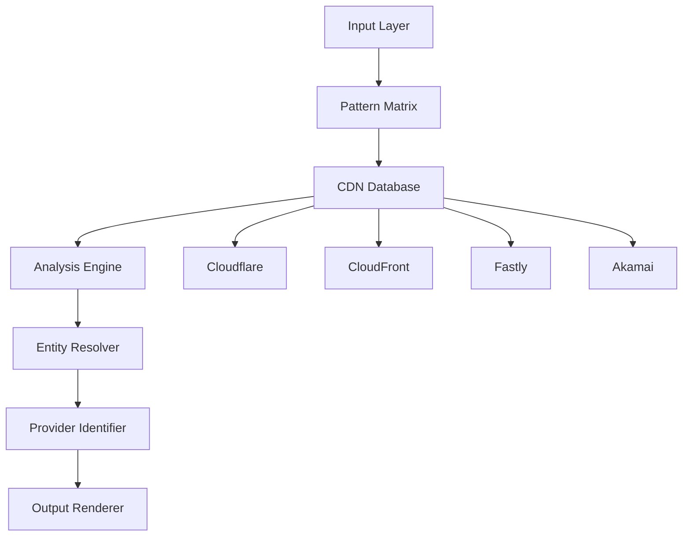

# 🚀 DRAKORYX - CDN Revelator

<p align="center">
  
  
  
  
</p>

<p align="center">
  <b>⚡ Advanced Cybernetic CDN Detection & Network Analysis Tool ⚡</b>
</p>

<p align="center">
  <i>"Revealing the hidden fabric of the internet's content delivery networks"</i>
</p>

---

📋 Table of Contents

· Overview
· Features
· Technical Architecture
· Installation
· Usage Guide
· CDN Providers Supported
· Output & Reporting
· Use Cases
· Security Considerations
· Contributing
· License

---

🔍 Overview

DRAKORYX is a sophisticated network analysis tool designed to detect and identify Content Delivery Network (CDN) protection on IP addresses and domains. Built for cybersecurity professionals, penetration testers, and network administrators, it provides deep visibility into the infrastructure behind websites and services.

Core Purpose

DRAKORYX helps security professionals:

· Identify if a target is protected by a CDN/WAF
· Determine which CDN provider is being used
· Discover origin server IPs hidden behind CDNs
· Map network infrastructure for security assessments
· Validate CDN configurations and exposures

---

⚡ Features

🎯 Core Capabilities

Feature Description
Multi-Provider Detection Identifies Cloudflare, CloudFront, Fastly, and Akamai
Bulk Scanning Process hundreds of targets with parallel threading
Intelligent Analysis Combines IP ranges, reverse DNS, and header analysis
Real-time Results Color-coded output with detailed entity information
Multiple Input Methods Interactive, CLI arguments, and pipe input

🛡️ Advanced Features

· 🔍 Reverse DNS Lookup - Identifies CDN infrastructure through DNS patterns
· ⚡ Parallel Processing - Multi-threaded scanning for high performance
· 📊 Statistical Analysis - Comprehensive scan statistics with success rates
· 💾 JSON Export - Structured output for integration with other tools
· 🎨 Visual Interface - Color-coded terminal output with cyberpunk aesthetic
· 🔒 Confidence Scoring - Quality assessment for detection results

🔬 Technical Capabilities

· IP Range Verification - Checks against official CDN provider IP lists
· Pattern Recognition - Identifies CDN signatures in headers and DNS
· Provider Fingerprinting - Distinguishes between different CDN technologies
· Origin Discovery - Reveals direct IPs alongside CDN-protected ones
· Response Time Analysis - Measures and displays network latency

---

🏗️ Technical Architecture

System Components



Data Flow

1. Input Processing
   · Accepts IPs, domains, or URLs
   · Validates and normalizes input
   · Removes protocol prefixes and subdomains
2. CDN Database Building
   · Fetches real-time IP ranges from CDN providers
   · Parses and validates CIDR blocks
   · Maintains up-to-date network lists
3. Entity Analysis
   · Resolves domains to IP addresses
   · Performs reverse DNS lookups
   · Compares against known CDN networks
   · Identifies CDN provider signatures
4. Results Generation
   · Formats output with color coding
   · Provides detailed entity information
   · Generates scan statistics
   · Exports structured JSON data

---

📦 Installation

Prerequisites

· Python 3.8 or higher
· pip (Python package manager)
· Internet connection for CDN data fetching

Quick Install

```bash
# Clone the repository
git clone https://github.com/sylhetyhackvenger/DRAKORYX 
cd DRAKORYX 

# Install dependencies
pip install -r requirements.txt

# Make executable (Linux/Mac)
chmod +x drakoryx.py
```

Dependencies

```bash
pip install click requests colorama
```

Docker Installation (Optional)

```dockerfile
FROM python:3.9-slim

WORKDIR /app

COPY requirements.txt .
RUN pip install --no-cache-dir -r requirements.txt

COPY drakoryx.py .

ENTRYPOINT ["python", "drakoryx.py"]
```

```bash
docker build -t drakoryx .
docker run -it drakoryx google.com
```

---

🚀 Usage Guide

Basic Usage

```bash
# Interactive Mode (will prompt for targets)
python drakoryx.py

# Single Target
python drakoryx.py google.com

# Multiple Targets
python drakoryx.py google.com cloudflare.com 1.1.1.1

# Pipe Input
cat targets.txt | python drakoryx.py

# Pipe Input with Options
cat targets.txt | python drakoryx.py -t 50 -o results.json
```

Command Line Options

Option Description Default
-t, --threads Number of parallel scanning threads 20
-o, --output Output file for JSON results None
--no-animation Disable loading animation False
--quiet Reduce output verbosity False

Advanced Examples

```bash
# High-performance scanning with 100 threads
python drakoryx.py -t 100 targets.txt

# Quiet mode with JSON output
python drakoryx.py --quiet -o results.json < targets.txt

# No animation, custom threads
python drakoryx.py --no-animation -t 30 google.com cloudflare.com

# Interactive mode with output
python drakoryx.py -o scan_results.json
```

Input Formats

DRAKORYX accepts the following formats:

```
# IP Addresses
192.168.1.1
8.8.8.8

# Domains (with or without protocol)
google.com
https://cloudflare.com
www.example.com
http://192.168.1.1

# Mixed input (one per line)
google.com
1.1.1.1
cloudflare.com
8.8.8.8
```

---

🌐 CDN Providers Supported

Cloudflare

· Detection Method: IP ranges, CF headers, reverse DNS patterns
· Coverage: Global Anycast network
· Signature: cf-* headers, cloudflare.com DNS

Amazon CloudFront

· Detection Method: IP ranges, x-amz-cf headers
· Coverage: Global edge network
· Signature: cloudfront.net, x-amz-cf-* headers

Fastly

· Detection Method: IP ranges, Fastly headers
· Coverage: Global edge cloud platform
· Signature: fastly.net, x-served-by headers

Akamai

· Detection Method: IP ranges, Akamai headers
· Coverage: Largest global CDN network
· Signature: akamai.net, x-akamai-* headers

---

📊 Output & Reporting

Terminal Output

DRAKORYX provides color-coded terminal output with detailed entity information:

```
┃ ⚡ PROXIED ◈ ┃ 📡 1.1.1.1 ┃ ⧫ Cloudflare ┃ ↳ one.one.one.one ┃ ⏱ 45.23ms
┃ ✦ DIRECT ◈ ┃ 🌐 google.com ┃ ⧫ Unknown ┃ ⇢ 142.250.185.78, 142.250.185.78 ... ┃ ⏱ 12.45ms
┃ ⚡ PROXIED ◈ ┃ 🌐 cloudflare.com ┃ ⧫ Cloudflare ┃ ⇢ 104.16.124.96, 104.16.125.96 ... ┃ ⏱ 34.12ms
```

Scan Statistics

```
┌─────────────────────────────────────────────────────────────┐
│  📊 SCAN STATISTICS                                        │
├─────────────────────────────────────────────────────────────┤
│  ⏱ Duration: 2.45s                                        │
│  📌 Total Scanned: 100                                     │
│  🟠 Proxied: 75 (75.0%)                                   │
│  🟢 Unproxied: 20 (20.0%)                                 │
│  ⚠ Errors: 5                                              │
│  💯 Success Rate: 95.0%                                   │
└─────────────────────────────────────────────────────────────┘
```

JSON Export

```json
{
  "build": "NEXUS-808",
  "timestamp": "2024-01-15T10:30:00.123456",
  "stats": {
    "total_scanned": 100,
    "proxied": 75,
    "unproxied": 20,
    "errors": 5,
    "start_time": "2024-01-15T10:30:00.123456"
  },
  "results": [
    {
      "identifier": "google.com",
      "entity_type": "domain",
      "cdn_status": false,
      "provider": null,
      "reverse_dns": null,
      "resolved_ips": ["142.250.185.78"],
      "response_time": 12.45,
      "confidence_score": 1.0,
      "timestamp": "2024-01-15T10:30:01.234567"
    }
  ]
}
```

---

🎯 Use Cases

Security Research

· Identify infrastructure behind WAF/CDN protections
· Map attack surfaces and origin servers
· Validate CDN configurations

Penetration Testing

· Bypass CDN protections to find origin IPs
· Identify potential misconfigurations
· Assess security posture of web applications

Network Administration

· Verify CDN implementation
· Monitor CDN provider usage
· Troubleshoot network routing issues

Threat Intelligence

· Identify malicious domains behind CDNs
· Track infrastructure changes
· Map threat actor infrastructure

---

🔒 Security Considerations

Best Practices

1. Legal Compliance
   · Only scan targets you own or have permission to test
   · Follow local cybersecurity regulations
   · Respect rate limiting and service terms
2. Responsible Usage
   · Use reasonable thread counts to avoid DoS
   · Implement delays for large-scale scanning
   · Document findings appropriately
3. Data Protection
   · Securely store JSON output files
   · Anonymize sensitive data when sharing
   · Use encryption for transmitted results

Limitations

· No Active Probing: Tool is passive, using only DNS and IP checks
· Static CDN Lists: Depends on provider API availability
· Detection Gaps: Some custom CDNs may go undetected
· Rate Limiting: Overly aggressive scanning may trigger blocks

---

🤝 Contributing

How to Contribute

1. Fork the Repository
2. Create a Feature Branch
3. Make Your Changes
4. Test Thoroughly
5. Submit a Pull Request

Development Setup

```bash
# Clone your fork
git clone https://github.com/sylhetyhackvenger/DRAKORYX 
cd DRAKORYX 

# Create virtual environment
python -m venv venv
source venv/bin/activate  # On Windows: venv\Scripts\activate

# Install development dependencies
pip install -r requirements-dev.txt

# Run tests
pytest tests/

# Check code style
flake8 drakoryx.py
```

Reporting Issues

When reporting issues, please include:

· Operating system and version
· Python version
· Full error output
· Steps to reproduce
· Example targets (sanitized if necessary)

---

📜 License

This project is licensed under the MIT License - see the LICENSE file for details.

---

📞 Contact & Support

# Author: SYLHETYHACKVENGER (THE-ERROR808)
· Security Issues: Please report responsibly via private channels
· General Support: Open an issue on GitHub

---

🙏 Acknowledgments

· CDN Providers: Cloudflare, Amazon, Fastly, and Akamai for public API access
· Open Source Community: For the amazing Python ecosystem
· Security Community: For continued research and development

---

<p align="center">
  <b>Made with ❤️ for the cybersecurity community</b>
</p>

<p align="center">
  <i>"In the digital frontier, knowledge is power - and DRAKORYX reveals what lies hidden"</i>
</p>

---

📚 Additional Resources

External Documentation

· Cloudflare IP Ranges
· CloudFront IP Ranges
· Fastly Public IP List
· Akamai IP Ranges

Related Tools

· cdncheck: Simple CDN IP checker
· massdns: Bulk DNS resolution tool
· shodan: Internet device search engine
· censys: Internet-wide scanning platform

---

🔄 Version History

Version Date Changes
NEXUS-808 2024 Initial release with full feature set
Future TBD Planned enhancements and provider updates

Planned Enhancements

☐ Additional CDN providers (Cloudflare, AWS, GCP)
☐ HTTP header analysis
☐ Geographic distribution analysis
☐ Web interface
☐ API mode for automation
☐ Performance optimizations
☐ More advanced fingerprinting

---

# DRAKORYX - Revealing the hidden architecture of the modern web
